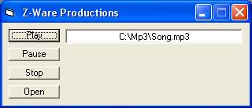



## Mp3 Player, using API mciSendString

### Description

This gives a fully working mp3 player. Easy made, to lern how to make mp3players easy :) *please rate*
 
### More Info
 

             |
---                |---
**Submitted On**   |2003-05-05 18:21:10
**By**             |[TJWeb](https://github.com/Planet-Source-Code/PSCIndex/blob/master/ByAuthor/tjweb.md)
**Level**          |Intermediate
**User Rating**    |4.8 (19 globes from 4 users)
**Compatibility**  |VB 6\.0
**Category**       |[Sound/MP3](https://github.com/Planet-Source-Code/PSCIndex/blob/master/ByCategory/sound-mp3__1-45.md)
**World**          |[Visual Basic](https://github.com/Planet-Source-Code/PSCIndex/blob/master/ByWorld/visual-basic.md)
**Archive File**   |[Mp3\_Player158387552003\.zip](https://github.com/Planet-Source-Code/tjweb-mp3-player-using-api-mcisendstring__1-45277/archive/master.zip)

